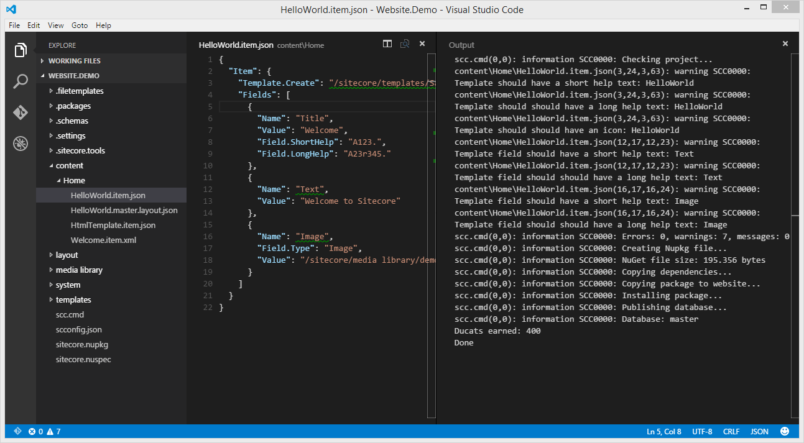

# Sitecore Pathfinder

Get started, get far, get happy!

An experimental tool chain for Sitecore.

 
Watch the videos on YouTube:

* [01 - Idea and concepts](https://www.youtube.com/watch?v=TcJ0IoI7sVM)
* [06 - Visual Studio, T4 templates, unit testing with FakeDB](https://youtu.be/_v6-1NKgxT0)

Please notice that some details in these videos are out of date.

* [02 - HelloWorld](https://www.youtube.com/watch?v=jQz5hAVOTzU)
* [03 - Unit Testing](https://www.youtube.com/watch?v=DWU6D7L8ykg) (Functionality removed) 
* [04 - Html Templates](https://www.youtube.com/watch?v=9aTGhW6ErYM)
* [05 - Code Generation, Visual Studio and Grunt](http://youtu.be/ZM3ve1WhwwQ)

Then download [Pathfinder 0.6.0-Alpha](http://vsplugins.sitecore.net/Pathfinder/Sitecore.Pathfinder.0.6.0.zip) to 
try it out.

# Introduction
Pathfinder is an experimental toolchain for Sitecore, that allows developers to use their favorite tools 
in a familiar fashion to develop Sitecore websites.

The toolchain creates a deliverable package from the source files in a project directory and deploys 
the package to a website where an installer installs the new files and Sitecore items.

The developer process is familiar; edit source files, build and install the package, run tests or review the 
changes on website, repeat.

*Please notice that this document is a brain dump, so concepts and functionality are probably not explained 
in a friendly manner.*

## How does Pathfinder make Sitecore development easier
* Familiar developer experience: Edit source files, build project, test, repeat...
* Text editor agnostic (Visual Studio not required - use Notepad, Notepad++, SublimeText, Atom, VS Code etc.)
* Build process agnostic (command-line tool, so it integrates easily with Grunt, Gulp, MSBuild etc.)
* Everything is a file (easy to edit, search and replace across multiple files, source control friendly)
* Project directory has whole and single truth (source is not spead across development projects, databases and websites) (contineous integration friendly) 
* Project is packaged into a NuGet package and deployed to the website
  * Dependency tracking through NuGet dependencies
  * NuGet package installer on Sitecore website
  * SitecorePathfinderCore NuGet package tweaks Sitecore defaults to be easier to work with (e.g. removes initial workflow)
* Support for Html Templates (with [Mustache](https://mustache.github.io/mustache.5.html) tags) makes getting started with the Sitecore Rendering Engine easier
* Code Generation for generating strongly typed item model, factories and unit tests
* Validate a Sitecore website against 70 rules using Sitecore Rocks SitecoreCop

# Documentation
For more documentation see [Pathfinder Documentation](docs/README.md).