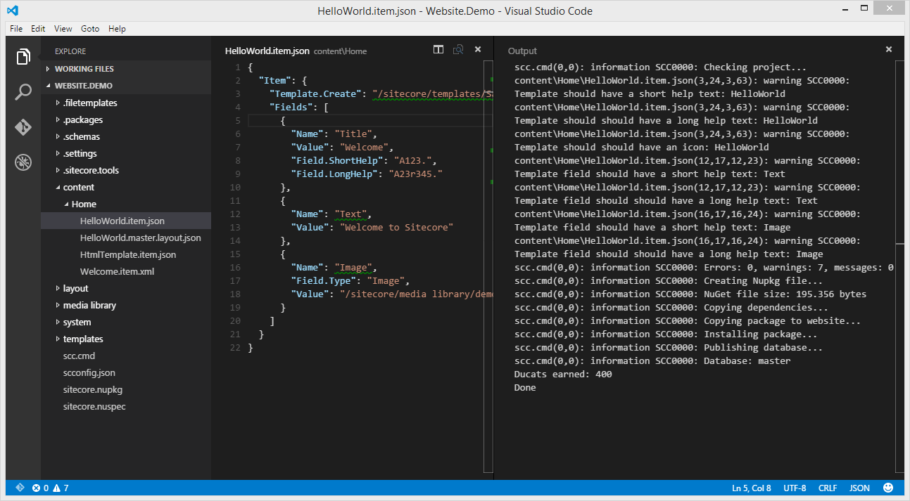
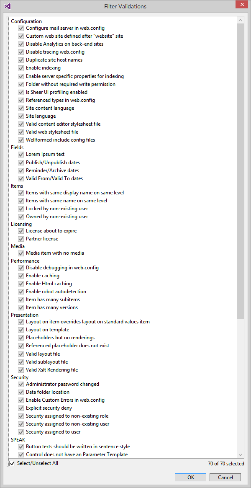
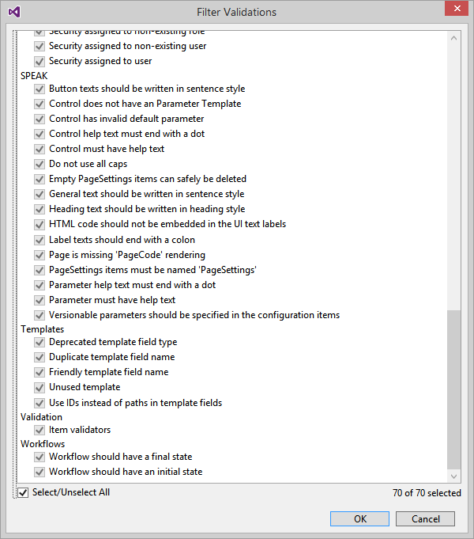

# Sitecore Pathfinder

### Disclaimer
Sitecore Pathfinder is a personal side project. It is not endorsed or supported by Sitecore in any way.

## Get Started
Get started, get far, get happy!


 
Watch the videos on YouTube:
* [01 - Idea and concepts](https://www.youtube.com/watch?v=TcJ0IoI7sVM)
* [02 - HelloWorld](https://www.youtube.com/watch?v=jQz5hAVOTzU)
* [03 - Unit Testing](https://www.youtube.com/watch?v=DWU6D7L8ykg)
* [04 - Html Templates](https://www.youtube.com/watch?v=9aTGhW6ErYM)
* [05 - Code Generation, Visual Studio and Grunt](http://youtu.be/ZM3ve1WhwwQ)

Then download [Sitecore Pathfinder](Sitecore.Pathfinder.zip) to try it out.

# Status

After giving Pathfinder some serious thought over the summer, I have come to this conclusion:


                   
I am pausing development for the time being.

# Introduction
Sitecore Pathfinder is a toolchain for Sitecore, that allows developers to use their favorite tools 
in a familiar fashion to develop Sitecore websites.

The toolchain creates a deliverable package from the source files in a project directory and deploys 
the package to a website where an installer installs the new files and Sitecore items into the website.

The developer process is familiar; edit source files, build and install the package, review the changes on website, repeat.

## Getting started

Pathfinder makes it easy to start working with Sitecore.

1. Install a clean Sitecore (e.g. using [SIM (Sitecore Instance Manager](https://marketplace.sitecore.net/modules/sitecore_instance_manager.aspx))
2. Create an empty folder and xcopy the Pathfinder files to the sitecore.tools subfolder
3. Execute the scc.exe in the sitecore.tools folder
4. Edit the scconfig.json file to setup 'project-unique-id', 'wwwroot' and 'host-name'
5. Done - you are now ready
6. Copy a starter kit to your project directory. Starter kits are located in sitecore.tools/files/starterkits/.

In step 3 Pathfinder creates a blank project for you. It consists of a number of directories and files, 
including an scc.cmd file which is a shortcut to the sitecore.tools\scc.exe file.

## How does Pathfinder make Sitecore easier
* Familiar developer experience: Edit source files, build project, test website, repeat.
* Text editor agnostic (Visual Studio not required - use Notepad, Notepad++, SublimeText, VS Code etc.)
* Build process agnostic (command-line tool, so it integrates easily with Grunt, Gulp, MSBuild etc.)
* Everything is a file (easy to edit, source control friendly)
* Project directory has whole and single truth (source is not spead across development projects, databases and websites, contineous integration friendly) 
* Project is packaged into a NuGet package and deployed to the website
  * Dependency tracking through NuGet dependencies
  * NuGet package installer on Sitecore website
  * Sitecore.Pathfinder.Core NuGet package tweaks Sitecore defaults to be easier to work with (e.g. removes initial workflow)
* Web Test Runner for running unit tests inside Sitecore website (supports dynamic compilation of C# source files)
* Support for Html Templates (with [Mustache](https://mustache.github.io/mustache.5.html) tags) makes getting started with the Sitecore Rendering Engine easier
* Validate a Sitecore website against 70 rules using Sitecore Rocks SitecoreCop

# Features

## Sitecore items and templates as files
In Pathfinder everything is a file, including Sitecore items. This is so that your project directory can contain the whole and single truth
about your project. Your project is no longer spread across development projects, databases and websites.

This is also how classic development projects work. In a Visual Studio application project every asset, that is needed by the application, is
included or referenced from the project.

Items are stored as file but can have a number of formats. Currently Json and Xml formats are supported, but plain file ansd Markdown will hopefully
be supported at some point. Json and Xml are good formats, since code editors can support schema validation and Intellisense.

Xml format (extension .item.xml) - please notice the namespace, which indicates the Xml schema to use.
```xml
<Item xmlns="http://www.sitecore.net/pathfinder/item" 
    Template="/sitecore/templates/Sample/Sample Item">
    <Field Name="Title">Pathfinder</Field>
    <Field Name="Text">Welcome to Sitecore Pathfinder</Field>
</Item>
```

Json format (extension .item.json): 
```js
{
  "Item": {
    "Template": "/sitecore/templates/Sample/Sample Item",
    "Fields": [
      {
        "Name": "Title",
        "Value": "Welcome"
      },
      {
        "Name": "Text",
        "Value": "Welcome to Sitecore"
      }
    ]
  }
}
```

You will notice that the examples above do not specify the name of the item. By default the name of the file (without extensions) is used
as item name.

Likewise the directory path is used as item path. The root of the project corresponds to /sitecore, so having the item file
"[Project]\content\Home\HelloWorld.item.xml" will create the item "/sitecore/content/Home/HelloWorld".

### File system mapping
The filesystem structure of the project does not necessary corresponds to the desired structure on the website.

In the scconfig.json file, you can map files and items to different locations on the website.

```js
"files": {
    "html": {
        "project-directory": "",
        "include": "/*.html",
        "website-directory": "/MyProject/layout/renderings",
        "item-path": "/sitecore/layout/renderings/MyProject",
        "database": "master"
    },
    "img": {
        "project-directory": "/img",
        "include": "**",
        "website-directory": "",
        "item-path": "/sitecore/media library/MyProject"
    }
}
```


#### Nested items
An item file can contain multiple nested items. Below is an example:

```xml
<Item xmlns="http://www.sitecore.net/pathfinder/item" Template="/sitecore/templates/Sample/Sample Item">
  <Field Name="Title" Value="Hello" />

  <Item Name="Hi" Template="/sitecore/templates/Sample/Sample Item">
    <Field Name="Title" Value="Hi" />
  </Item>

  <Item Name="Hey" Template="/sitecore/templates/Sample/Sample Item">
    <Field Name="Title" Value="Hey" />
  </Item>
</Item>
```
This create an item with two children; Hi and Hey:

* HelloWorld
  * Hi
  * Hey


### Templates
Template can be defined in items files using a special schema. Below is an example:

```xml
<Template xmlns="http://www.sitecore.net/pathfinder/item">
    <Section Name="Data">
        <Field Name="Title" Type="Single-Line Text"/>
        <Field Name="Text" Type="Rich Text"/>
        <Field Name="Always Render" Type="Checkbox" Sharing="Shared"/>
    </Section>
</Template>
```

Templates can be nested in the same way that multiple items can be nested inside an item file.

#### Inferred templates
If you have a template that is used by a single item, you can have Pathfinder automatically create the template from the fields in the
item - Pathfinder will infer the template fields from the fields you specify in the item.

To infer and create the template use the "Template.Create" attribute instead of the "Template" attribute in item files.

```xml
<Item xmlns="http://www.sitecore.net/pathfinder/item" Template.Create="/sitecore/templates/Sample/InferredTemplate">
  <Field Name="Text" Value="Hello" Field.Type="Rich Text" />
</Item>
```
The example above creates the template "InferredTemplate" with a single template field "Text". The type of the field is "Rich Text".


### Item IDs
Normally you do not need to specify the ID of an item, but in some case, it may be necessary. Pathfinder supports soft IDs meaning that the
item ID does not have to be a Guid (but it can be).

By default Pathfinder calculates the ID of an item hashing the project unique ID and the file path (without file extensions), like this 
`item.Guid = MD5(Project_Unique_ID + item.FilePath)`. This means that the item ID is always the same, as long as the file path remains the same.

You can explicitly set the ID by specifying the ID in item file as either a Guid or as a soft ID.

* If no ID is specified, the item ID is calculated as `item.Guid = MD5(Project_Unique_ID + item.ItemPath)`.
* If the ID is specified as a Guid, the item ID uses Guid as is.
* If the ID is specified (but not a Guid), the item ID is calculated as `item.Guid = MD5(Project_Unique_ID + item.ID)`.

If you rename an item, but want to keep the original item ID, specify the ID as the original file path (without extensions), e.g.:
```xml
<Item xmlns="http://www.sitecore.net/pathfinder/item" 
    Id="/sitecore/content/Home/HelloWorld" 
    Template="/sitecore/templates/Sample/Sample Item">
    <Field Name="Title">Pathfinder</Field>
    <Field Name="Text">Welcome to Sitecore Pathfinder</Field>
</Item>
```

### Content item format
Content item files also contain items, but the schema is different. When you synchronize the website, Pathfinder generates and downloads a
schema, that contains all templates in the database (master and core database). If you change a template, you will have to synchronize the
website again.

The schema of content files ensures, that you can only specify fields that appear in the template, and provide some nice Intellisense in most 
code editors. The format of content item files is also more compact than other types of item files.

So the advantages of content item files are validation against the template and a more compact format, but you have to synchronize the 
website, if you change a template.
                                                                                         

### Media files
If you drop a media file (.gif, .png, .jpg, .bmp, .pdf, .docx) into your project folder, Pathfinder will upload the file to the Media Library.
The Sitecore item will be implicit created. 

### Layouts and renderings
Layout and rendering files (.aspx, .ascx, .cshtml, .html) are copied to the website directory and the Sitecore items are automatically created.
You no longer have to explicitly create and configure a Sitecore Rendering or Layout item. The relevate fields (including the Path field) are
populated automatically.

### Json layout format
TBD

### Populating additional fields for implicitly created items
Supposed you have an MVC View rendering HelloWorld.cshtml and want to set the Parameters field. Simply create a HelloWorld.item.xml (or 
HelloWorld.item.json) next to the HelloWorld.cshtml file.

* HelloWorld.cshtml
* HelloWorld.item.json

When determining the item name, Pathfinder uses the field up until the first dot - in this case "HelloWorld". When two or more files have the
same item name (and item path), they are merged into a single item. Pathfinder will report an error if a field is set more than once with different
values.

### Supported file formats

Extension            | Description 
-------------------- | ------------
.item.xml            | Item in Xml format
.item.json           | Item in Json format
.master.content.xml  | Item in Xml content format (master database)
.core.content.xml    | Item in Xml content format (core database)
.master.content.json | Item in Json content format (master database)
.core.content.json   | Item in Json content format (core database)
.master.layout.xml   | Layout definition in Xml format (master database)
.core.layout.xml     | Layout definition in Xml format (core database)
.master.layout.json  | Layout definition in Json format (master database)
.core.layout.json    | Layout definition in Json format (core database)
.dll                 | Binary file - copied to /bin folder
.aspx                | Layout file
.ascx                | SubLayout
.cshtml              | MVC View Rendering
.html                | Html file (MVC View Rendering) with Mustache syntax support
.htm                 | Html file
.js                  | JavaScript content file
.css                 | Stylesheet content file
.config              | Config content file

## Extensions
Pathfinder includes the Roslyn compiler to compile extensions on the fly. Extensions are C# files that are compiled and loaded dynamically through 
(MEF)[https://msdn.microsoft.com/en-us/library/dd460648(v=vs.110).aspx]. This allows you to extend Pathfinder with new tasks, checkers, code 
generation handler and much more. 

When Pathfinder starts it looks through the /sitecore.tools/files/extensions directory to find any extension files, and if any file is newer than the
Sitecore.Pathfinder.Extensions.dll assembly, it recompiles the files and saves the output as Sitecore.Pathfinder.Extensions.dll.

For instance to make a new checker, duplicate a file in /sitecore.tools/files/extensions/checkers and start Pathfinder. Pathfinder will detect the
new file and recompile the assembly.

## Unit testing
[Watch the video](https://www.youtube.com/watch?v=DWU6D7L8ykg)

Unit testing in Sitecore can be tricky for a number of reasons. One reason is that sometimes you want your 
unit test to be executed within the Sitecore web context. Unless you have advanced mocking capabilities, this
requires you to make a request to a Sitecore website and run the tests.

Pathfinder installs a Web Test Runner in your Sitecore website. When you run the `run-unittests` task, Pathfinder
copies the unit test C# files to the server, compiles them and runs the tests.

This makes it easy to write server-side unit tests in you project and execute the in a Sitecore web context.

## Website validation
Pathfinder integrates with the Sitecore Rocks SitecoreCop feature. SitecoreCop examines the website and can identify
over 70 different types of issues. To validate the website, run the task `validate-website`.




## Layout Engines

### Sitecore rendering engine
Pathfinder supports the Sitecore Rendering Engine by supporting a special format for the __Rendering field. 
The format is similar to Html and Xaml, and is parsed when the package is installed into Xml format, that 
Sitecore expects. 

Here is an example of the format in Json.
```js
{
    "Layout": {
        "Devices": [
            {
                "Name": "Default",
                "Layout": "/sitecore/layout/layouts/MvcLayout",
                "Renderings": [
                    {
                      "HelloWorld": {
                      } 
                    }
                ]
            }
        ]
    }
}
```

### Html Templates
[Watch the video](https://www.youtube.com/watch?v=9aTGhW6ErYM)

Pathfinder also supports Html Templating which is simpler way of working with layouts. It resembles working with Mustache
Html Templates in JavaScript. However the Html Templates are resolved on the server and adapted to the Sitecore 
rendering engine.

When using Html Template, you do not have to specify a layout definition or use MVC views. Html Templates are not as 
powerful as the full Sitecore Rendering Engine, placeholders or using MVC views.

On an item, you specify the file name of the Html Template, you want to use, in the "Layout.HtmlFile" property (please notice 
that this property has been renamed from the video where it was called "HtmlTemplate").
```js
{
  "Item": {
    "Layout.HtmlFile": "/layout/renderings/HtmlTemplate.html",
  }
}
```

The Html Template is a Html file that also supports Mustache like tags.

```html
<h1>Fields</h1>
<p>
    {{Title}}
</p>
<p>
    {{Text}}
</p>
{{> Footer.html}}
```

The `{{Title}}` tags will be replace with the Title field in the current context item.

Please notice that Mustache lists and partials are supported (see the Footer tag in the last line). Pathfinder extends the 
Mustache syntax to support Sitecore placeholders - the tag `{{% placeholder-name}}` will be rendered as a Sitecore
placeholder.

Pathfinder creates .html as View renderings and these renderings can used as any other Sitecore rendering.

## Code Generation
*Please notice that the video is out-of-date. Code Generation now uses extensions and not Razor files.*

[Watch the video](http://youtu.be/ZM3ve1WhwwQ)

Pathfinder can generate code based on your project. The most obvious thing is to generate a C# class for each template in
the project.

To generate code, execute the task `generate-code`. This wil iterate through the elements in the project and check if
a code generator is available for that item. If so, the code generator is executed.

Code generators are simply extensions that are located in the /sitecore.tools/extensions/codegen directory.

Normally you want to run the `generate-code` task before building an assembly, so the C# source files are up-to-date.


# Environment

## Notepad
Everything in Pathfinder is a file, so you can use Notepad to edit any file.

## Visual Studio Code

[Visual Studio Code](https://code.visualstudio.com/) is a nice code editor and Pathfinder contains default
configuration files for Code in the .settings directory. The default build task in Code has been configured
to execute the build pipeline in Pathfinder. In Code the build task can be executed by pressing Ctrl+Shift+B.

## Visual Studio

1. Create a web project in Visual Studio
1. Add a reference to Sitecore.Kernel
1. Install the Sitecore Pathfinder Nuget package
1. Install GruntJS. Run installgrunt.cmd or
   1. Install GruntJS in the project: npm install grunt --save-dev
   1. Install grunt-shell: npm install --save-dev grunt-shell
1. Right-click gruntfile.js and select Task Runner Explorer
1. Add the following lines to gruntfile.js

```js
module.exports = function (grunt) {
    grunt.initConfig({
        shell: {
            "build-project": {
                command: "scc.cmd"
            },
            "run-unittests": {
                command: "scc.cmd run-unittests"
            },
            "generate-unittests": {
                command: "scc.cmd generate-unittests"
            },
            "generate-code": {
                command: "scc.cmd generate-code"
            },
            "sync-website": {
                command: "scc.cmd sync-website"
            },
            "validate-website": {
                command: "scc.cmd validate-website"
            }
        }
    });

    grunt.registerTask("build-project", ["shell:build-project"]);
    grunt.registerTask("run-unittests", ["shell:run-unittests"]);
    grunt.registerTask("generate-unittests", ["shell:generate-unittests"]);
    grunt.registerTask("generate-code", ["shell:generate-code"]);
    grunt.registerTask("sync-website", ["shell:sync-website"]);
    grunt.registerTask("validate-website", ["shell:validate-website"]);

    grunt.loadNpmTasks("grunt-shell");
};
```

10. In Task Runner Explorer, right-click 'build-project' and select Bindings | After Build. This will run Pathfinder after each build.
10. If you want to use code generate, right-click 'generate-code' and select Binding | Before Build.


## Sitecore toolbox
As a Sitecore developer, what should be in your development toolbox? 

Application   | Description | Difficulty
------------- | ------------| ----------
[SIM (Sitecore Instance Manager](https://marketplace.sitecore.net/modules/sitecore_instance_manager.aspx) | Sitecore website installer and more | Low to medium
[Sitecore Powershell Extensions](https://marketplace.sitecore.net/en/Modules/Sitecore_PowerShell_console.aspx) | Run Powershell scripts in a Sitecore website | High
[Sitecore Rocks Visual Studio](https://visualstudiogallery.msdn.microsoft.com/44a26c88-83a7-46f6-903c-5c59bcd3d35b/) | Visual Studio plugin for working with Sitecore | Low to high
[Sitecore Rocks Windows](https://github.com/JakobChristensen/Sitecore.Rocks.Docs) | Sitecore Rocks version that does not require Visual Studio | Low to high
[Sitecore Pathfinder](https://github.com/JakobChristensen/Sitecore.Pathfinder) | Sitecore build toolchain | Low

