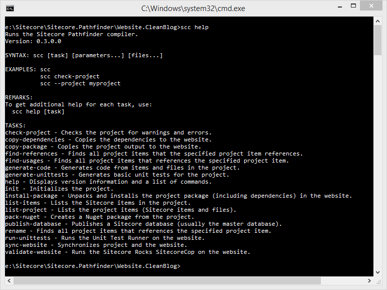

# Getting started
The goal of Pathfinder is to make it easy to start working with Sitecore.

## Installing Pathfinder

1. Download [Pathfinder 0.6.0-Alpha](http://vsplugins.sitecore.net/Pathfinder/Sitecore.Pathfinder.0.6.0.zip)
2. Unzip the sitecore.tools directory in the zip file into an empty directory, e.g. c:\Program Files (x86)\Sitecore\Pathfinder 
(the path to scc.exe should now be c:\Program Files (x86)\Sitecore\Pathfinder\scc.exe)
3. Optional: Add the directory to your Path environment variable
4. Done

## Creating a new project

1. Install a Sitecore website (e.g. using [SIM (Sitecore Instance Manager)](https://marketplace.sitecore.net/modules/sitecore_instance_manager.aspx)
2. Create an empty directory (seperate from the Sitecore website directory)
3. Run `scc new-project` in the directory
4. Enter Project Unique ID, website directory, Data Folder directory and a hostname
5. Done

## Importing an existing project
1. Create a new (blank) project (see above)
2. Configure the import-website task in the scconfig.json file
3. Run `scc import-website` in the directory
4. Done

## The smoothest setup
* Add the Pathfinder binaries to your environment path, so it can be executed from anywhere.
* Use a project folder structure like this - it is compatible with ASP.NET 5, NodeJS and Sitecore serialization.
```
<project name>\
    bin\
    content\
        core\
        master\
    sitecore.project\
    views\
    wwwroot\
```

* Use the default website structure.
```
<website name>\
    Data\
    Databases\
    Website\
```

* Keep your project and website separate - this makes it easier to see what is in your project, and you can upgrade your website to another versionb easily.
* Setup website to projects mappings. This allows you to use the Serializing Data Provider and the `reset-website` task.
* Do not disable any checkers - the checkers are there for a good reason, and you should strive for no warnings or errors.
* Consider using the `install-project` task instead of the creating and deploying a package. It speeds up the build process a lot.
* Consider using the `watch-project` task. Any change you make will be automatically deployed.
* Use the `generate-code` task to automate trivial coding tasks.
* Use source control.

## Command line help
To get help, you can execute the Help task by entering `scc help`.

To get help about a specific task, execute the Help task with the name of the task as a parameter: `scc help [task name]`


