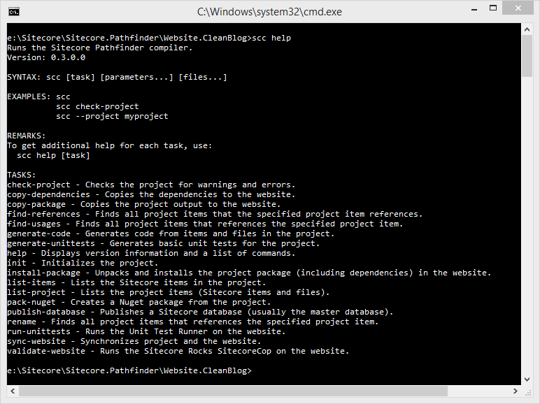

# Command line help
To get help, you can execute the Help task by entering `scc help`.

To get help about a specific task, execute the Help task with the name of the task as a parameter: `scc help [task name]`

