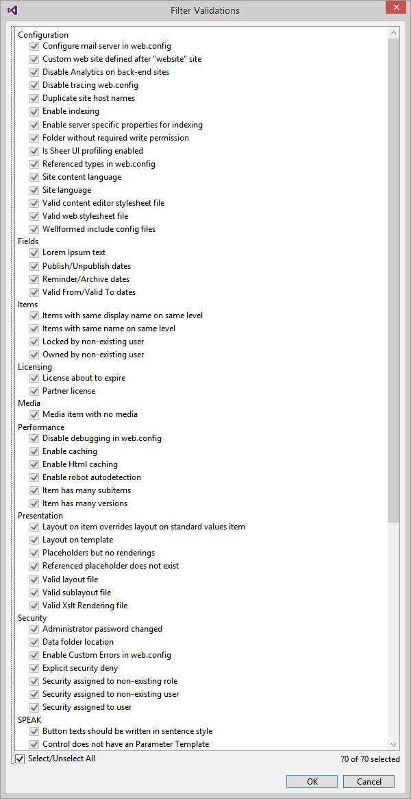

# Website validation
Pathfinder integrates with the Sitecore Rocks SitecoreCop feature. SitecoreCop examines the website and can identify
over 70 different types of issues. To validate the website, run the task `validate-website`.

