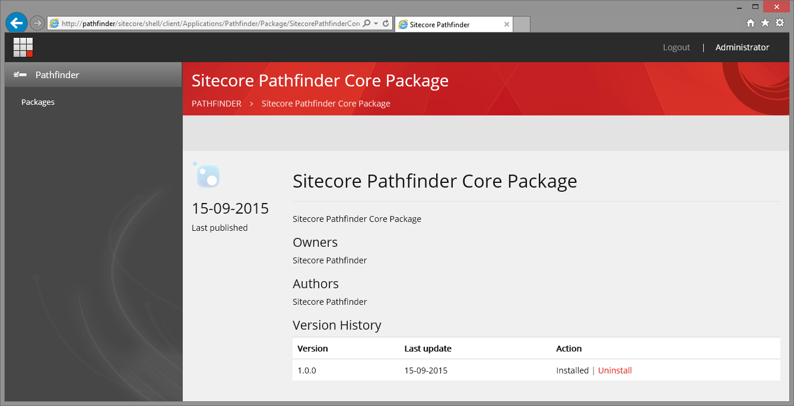

# Package User interface
Pathfinder installs a UI for managing packages on the website. While the Package Manager can uninstall NuGet packages, it
does not (yet) remove files are items from the website - only the installed NuGet package is removed.

The Package Manager is located at the Url: /sitecore/shell/client/Applications/Pathfinder/Packages

