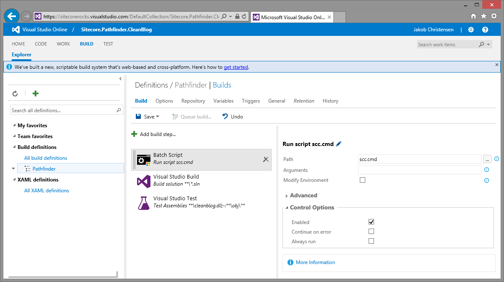

# External tools
There are many good 3. party tools for Sitecore. These are some of my personal thoughts on how to use/integrate these tools with Pathfinder. Please notice
that these thoughts do not reflect the official Sitecore opinions in any form. I do apologies in advance for misunderstanding or not knowing 
any of the tools in depth.

Many tools are available as either Sitecore Packages or NuGet packages.

Sitecore Packages can be installed by downloading the package to [Project]/sitecore.project/packages, wrapping it in a NuGet
package (using the ``pack-dependencies`` task) and making it a dependency. 

NuGet Packages can be installed by downloading the package to [Project]/sitecore.project/packages, and making it a dependency. 

### TDS
[TDS](https://www.hhogdev.com/Downloads/Team-Development-for-Sitecore.aspx) is a commercial Visual Studio plugin that primarily implements 
good serialization/deserialization functionality in Sitecore. Over time TDS has grown and support many additional features like best practices 
and code generation. TDS is battle proven and robust.

There is some overlap in functionality between Pathfinder and TDS. It could be interesting to have TDS support the Pathfinder compiler, but that is 
probably unlikely to happen.

### Razl
[Razl](https://www.hhogdev.com/products/razl.aspx) is another tool from Hedgehog that allows you to compare the items in two Sitecore websites.
Razl is very useful.

There is no overlap between Razl and Pathfinder and I see no obvious integration.

### Visual Studio Online
[Visual Studio Online](https://www.visualstudio.com/en-us/products/what-is-visual-studio-online-vs.aspx): Services for teams to share code, 
track work, and ship software - for any language, all in a single package. It's the perfect complement to your IDE.

It is a goal that Pathfinder integrates with Visual Studio Online. Pathfinder fits in the Build part of Visual Studio Online and it is pretty easy to 
setup.

1. Add a Batch Script build task and set the Path to "scc.exe".
2. *Optional:* Add a Visual Studio Build build task and set the Solution to **/*.sln.
3. *Optional:* Add a Visual Studio Test build task and set the Test Assembly to your output assembly.

This will execute Pathfinder whenever Visual Studio Online builds your project.

If Visual Studio Online does not have access to your website, you should probably remove the deployment tasks from the build-project/tasks settings.

### SQL LocalDb
Sitecore requires a SQL Server and it can be a hassle to setup. Consider using LocalDB instead.

See [http://sitecoresupport.blogspot.dk/2012/03/sitecore-on-sql-2012-denali-with.html](http://sitecoresupport.blogspot.dk/2012/03/sitecore-on-sql-2012-denali-with.html)

1. Install SQL Server LocalDB using Web Platform Installer.
1. Modify /App_Config/ConnectionStrings.xml to use "Server=(localdb)\v11.0; Integrated Security=true; AttachDbFileName=E:\db\Sitecore.Core.MDF" ...
1. Change the AppPool Identity of the IIS Website to "LocalSystem"
1. Start SQL LocalDB service using "sqllocaldb.exe start v11.0"

### IIS Express
Sitecore requires IIS to run. Consider using IIS Express.

See [http://chrismcleod.me/2011/01/14/iis-express-website-here-shell-extension/](http://chrismcleod.me/2011/01/14/iis-express-website-here-shell-extension/)

1. Install IIS Express Website Here

### Sitecore Powershell Extensions
[Powershell Extensions](https://marketplace.sitecore.net/en/Modules/Sitecore_PowerShell_console.aspx) adds Powershell capabilities to Sitecore. 
You can open a Powershell window in the Sitecore desktop and execute Powershell scripts. Powershell Extensions are very well documented and very
popular.

Powershell Extensions is a Sitecore package and can be installed as such. 

It could be interesting to have Pathfinder be able to execute Powershell scripts on the website. Pathfinder could contain a Powershell task that
sends a Powershell script to Powershell Extensions which executes it and returns the result. The question is if developer would prefer this approach
over opening a Powershell Extensions window in the Sitecore desktop.

### Glass.Mapper
[Glass.Mapper](http://www.glass.lu/) is the only ORM you will need to improve your Sitecore and Umbraco development. It only takes a few minutes to 
setup and then you are ready to start using classes and interfaces in your project.

Glass.Mapper is popular and battle proven.

Pathfinder could work with Glass.Mapper by having Pathfinder generate classes for Glass.Mapper using the 'generate-code' task. 

### Zen Garden
[Zen Garden](https://www.cognifide.com/accelerators/zen-garden-sitecore) accelerates deployment of responsive websites quickly and cost effectively, 
minimising reliance on technical skills while improving maintenance of governance standards. 

Zen Garden is a full fletched framework and I don't see any obvious integrations with Pathfinder.

### BrainJocks SCORE
[BrainJocks SCORE](http://www.brainjocks.com/company/score) is a comprehensive development framework that will transform your Sitecore experience.

SCORE seems like a full fletched framework and I don't see any obvious integrations with Pathfinder.

### Sitecore Rocks
[Sitecore Rocks](https://github.com/JakobChristensen/Sitecore.Rocks.Docs) is both a Visual Studio plugin (Sitecore Rocks Visual Studio) and 
a stand-alone Windows application (Sitecore Rocks Windows), which is installed using Click-Once. Sitecore Rocks is both a development and an 
administration tool. It is big and somewhat bloated, but popular. Sitecore developer training uses Sitecore Rocks.

Sitecore Rocks allows you to edit items directly on the website which Pathfinder discourages.

The Sitecore Rocks and Pathfinder can probably be integrated in numereous ways. Sitecore Rocks does not implement a deployment mechanism and 
serialization support is very basic. Sitecore Rocks could contain a Visual Studio project template for Pathfinder.

### Sitecore Habitat
[Sitecore Habitat](https://github.com/Sitecore/Habitat) is a solution framework focusing on three aspects:

* Simplicity - A consistent and discoverable architecture
* Flexibility - Change and add quickly and without worry
* Extensibility - Simply add new features without steep learning curve

Sitecore Habitat could be a fantastic solution on top of Pathfinder. It describes how to architect a good Sitecore website which is a goal
of Pathfinder. 

It would be great if Pathfinder could build a Habitat-based website out of the box. The developer would get a tool chain and a website 
framework as a starting point.

Pathfinder support Unicorn, which is used by Habitat. It could be interesting to have a code generator for the TemplateIds file in Habitat.

### FakeDB
Watch the video: [06 - Visual Studio, T4 templates, unit testing with FakeDB](https://youtu.be/_v6-1NKgxT0)

[FakeDb](https://github.com/sergeyshushlyapin/Sitecore.FakeDb) is the unit testing framework for Sitecore that enables creation and manipulation 
of Sitecore content in memory. It is designed to minimize efforts for the test content initialization keeping focus on the minimal test 
data rather than comprehensive content tree representation.  

FakeDB is available as a NuGet package and can be installed as such. 

FakeDB and Pathfinder could be integrated in a number of ways. Pathfinder provides a T4 template that exposes the items in the project to FakeDB, so
developers do not have to do this manually. 

It would be really nice if Pathfinder could execute tests against FakeDB. 

### JsonDataProvider
[JsonDataProvider](https://github.com/Sitecore/Sitecore.JsonDataProvider) allows storing parts of content tree in separate *.json files.
Unlike serialization, items exist only in *.json files which makes synchronization unnecessary.
Single *.json file stores all descendant items of the specific item that exists in a SQL database.

The JsonDataProvider could be very valuable for Pathfinder if it could handle any item changes by the Pathfinder installer. That way the items in 
original website are not touched and the website remains clean. To remove any installed items, simply remove the JsonDataProvider Json file.

This is one to keep an eye on.

### Unicorn
[Unicorn](https://github.com/kamsar/Unicorn) is a utility for Sitecore that solves the issue of moving templates, renderings, and other database 
items between Sitecore instances. The default Sitecore data provider is extended to automatically serialize item changes as they are made to 
Sitecore. This means that at any given time, what's serialized is the "master copy."  

Unicorn removes the manual process of serializing items which solves a lot of issues and it can be used for CI.

Pathfinder supports Unicorn.

Unicorn could be interesting for Pathfinder if it can update files in the project when the website is changed. Suppose items are create on the website
in a custom manner. Unicorn could feed these items back to the project.

Unicorn also supports the [Rainbow](https://github.com/kamsar/Rainbow) project which changes the serialization format to Yaml which Pathfinder supports. 
(Rainbow was the inspiration for supporting Yaml in Pathfinder).

### Sitecore Courier
[Sitecore Courier](https://github.com/adoprog/Sitecore-Courier) lets you build Sitecore Update packages automatically, by analyzing serialized 
Sitecore items and packaging only changed items. Packages will be generated automatically, by comparing serialization from TAG (source) to the 
TRUNK (target). Incremental package will contain only changed items.

This is a cool idea. It can build update packages by comparing item in a source folder with a tag in source control. This should scale well
for website with lots of content.

Pathfinder works a bit differently by defining that the project must contain all assets used by the project. However Sitecore Courier could be 
use to create an update package for a new version of a project. 

Pathfinder could also use Sitecore Courier internally to deploy the package instead of using NuGet. It might be faster.

### Sitecore Ship
[Sitecore Ship](https://github.com/kevinobee/Sitecore.Ship) is a lightweight means to install Sitecore Update packages via HTTP requests.

There is a big overlap between Sitecore Ship and Pathfinder, but Sitecore Ship does one thing and probably does it very well. Since it is developed
by Kevin Obee, it is probably very secure.

Pathfinder could use Sitecore Ship internally to deploy update packages. It might be faster.

