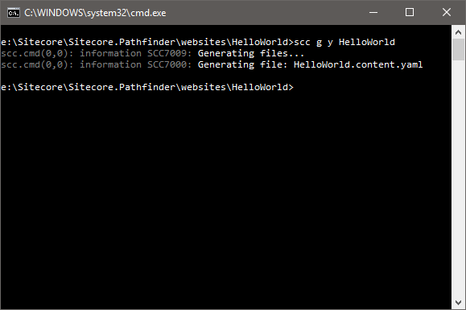

# Hello world

This walkthrough shows how to build a Hello World website.

The following assumes, that you have already setup Pathfinder and created a new Sitecore website.

## Create an empty folder

Create a new empty folder that will contain your project. This folder should be separate from the
Sitecore website, so you project folder only contains the project files.


## Create project files

Create an empty project by executing `scc add-project`. The will copy a number of files to your projects.


## Edit scconfig.json

Open the `scconfig.json` file in Notepad and change the `project-unique-id`, `website-directory`,
`data-folder-directory` and `host-name` settings to appropriate values.


## Create HelloWorld item file

Create a new item file by copying the item.item.json file to the `/items/master/sitecore/content/Home/` directory.

```
copy sitecore.filetemplates\json\item.item.json items\master\sitecore\content\Home\HelloWorld.item.json
```



## Edit the HelloWorld item

Open the file in Notepad and paste the following text into it.

```js
{
    "$schema": "sitecore.project/schemas/item.schema.json",
    "Item": {
        "Template": "/sitecore/templates/Sample/HelloWorld",
        "Template.CreateFromFields": true,
        "Template.ShortHelp": "Short help.",
        "Template.LongHelp": "Short help.",
        "Template.Icon": "Applications/16x16/about.png",
        "Fields": {
            "Title": {
                "Value": "Pathfinder",
                "Field.LongHelp": "Long help.",
                "Field.ShortHelp": "Short help."
            },
            "Text": {
                "Value": "Welcome to Sitecore Pathfinder",
                "Field.ShortHelp": "Short.",
                "Field.LongHelp": "Longer help."
            },
            "Image": {
                "Value": "",
                "Field.Type": "Image",
                "Field.ShortHelp": "Short.",
                "Field.LongHelp": "Longer help."
            }
        }
    }
}
```

This item file create the /sitecore/content/Home/HelloWorld item and /sitecore/templates/Sample/HelloWorld template.

## Compile the project

Compile the project by executing `scc` in the command prompt. 


Check that there are no errors or warnings. Additional you can open Sitecore and check that the HelloWorld
item has been created in the master database in `/sitecore/content/Home/HelloWorld`.

## Adding an image

Copy an image file to the `/items/master/sitecore/media library`, e.g. 'lighthouse.jpg'.


## Add a reference to the image

Open the `/items/master/sitecore/content/Home/HelloWorld.item.json` file in Notepad and edit the Image field value
to point to the image item. This is the name of the image item - not the file name.

```js
{
    "$schema": "sitecore.project/schemas/item.schema.json",
    "Item": {
        "Template": "/sitecore/templates/Sample/HelloWorld",
        "Template.CreateFromFields": true,
        "Template.ShortHelp": "Short help.",
        "Template.LongHelp": "Short help.",
        "Template.Icon": "Applications/16x16/about.png",
        "Fields": {
            "Title": {
                "Value": "Pathfinder",
                "Field.LongHelp": "Long help.",
                "Field.ShortHelp": "Short help."
            },
            "Text": {
                "Value": "Welcome to Sitecore Pathfinder",
                "Field.ShortHelp": "Short.",
                "Field.LongHelp": "Longer help."
            },
            "Image": {
                "Value": "/sitecore/media library/lighthouse",
                "Field.Type": "Image",
                "Field.ShortHelp": "Short.",
                "Field.LongHelp": "Longer help."
            }
        }
    }
}
```

Compile the project again to make sure there are no errors or warnings.

## Add a new rendering

Copy a Razor view to the `items/master/sitecore/layout/renderings/` directory.
```
copy sitecore.filetemplates\cshtml\rendering.cshtml items\master\sitecore\layout\renderings\HelloWorld.cshtml
```

Open the HelloWorld.cshtml file in Notepad and paste the following text:

```
@model Sitecore.Mvc.Presentation.RenderingModel
@{
}
<h1>@Model.Item["Title"]</h1>
<p>@Model.Item["Text"]</p>
@Html.Sitecore().Field("Image")
```

This will render the image field.

## Edit the layout

Edit the layout on the HelloWorld item to include the new rendering.

```js
{
    "$schema": "sitecore.project/schemas/item.schema.json",
    "Item": {
        "Template": "/sitecore/templates/Sample/HelloWorld",
        "Template.CreateFromFields": true,
        "Template.ShortHelp": "Short help.",
        "Template.LongHelp": "Short help.",
        "Template.Icon": "Applications/16x16/about.png",
        "Fields": {
            "Title": {
                "Value": "Pathfinder",
                "Field.LongHelp": "Long help.",
                "Field.ShortHelp": "Short help."
            },
            "Text": {
                "Value": "Welcome to Sitecore Pathfinder",
                "Field.ShortHelp": "Short.",
                "Field.LongHelp": "Longer help."
            },
            "Image": {
                "Value": "/sitecore/media library/lighthouse",
                "Field.Type": "Image",
                "Field.ShortHelp": "Short.",
                "Field.LongHelp": "Longer help."
            },
            "Layout": {
                "Devices": [
                    {
                        "Name": "Default",
                        "Layout": "/sitecore/layout/Layouts/MvcLayout",
                        "Renderings": [
                            {
                                "HelloWorld": { }
                            }
                        ]
                    }
                ]
            }
        }
    }
}
```

Compile the project again.

## Open in browser

Open the URL [website]/Home/HelloWorld in a browser.


