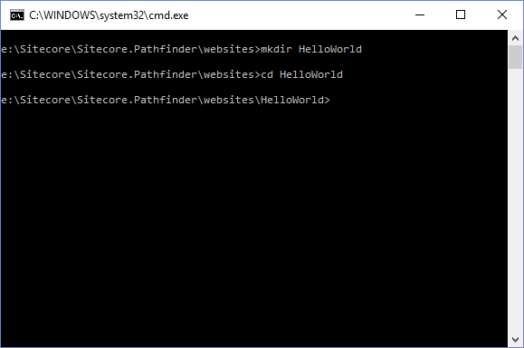

# Hello world

This walkthrough shows how to build a Hello World website.

The following assumes, that you have already setup Pathfinder and created a new Sitecore website.

## Create an empty folder

Create a new empty folder that will contain your project. This folder should be separate from the
Sitecore website, so you project folder only contains the project files.



## Create HelloWorld item file

Create a new item file by executing the `generate-file` task.

```
scc g y HelloWorld
```


## Edit the HelloWorld item

Open the file in Notepad and paste the following text into it.

```yaml
- Sample Item: HelloWorld
    ItemPath: /sitecore/content/Home/HelloWorld
    Database: master
    - Fields:
        - en:
            Title: Hello World
            Text: Hello from Pathfinder
```

This item file will create the /sitecore/content/Home/HelloWorld item.

## Compile the project

Compile the project by executing `scc b` in the command prompt. 


Check that there are no errors or warnings.

There should now be a Package.zip file in the ./dist directory. 

Try installing the Package.zip file in the Sitecore website and check that the /sitecore/content/Home/HelloWorld item has been created.

## Create a new template

Create a new file HelloWorldTemplate.content.yaml with the following contents:

```yaml
- Template: HelloWorldTemplate
    ItemPath: /sitecore/templates/HelloWorldTemplate
    Database: master
    - Section: Data
        - Field: Title
            Type: Single-Line Text
            Sharing: Versioned
        - Field: Text
            Type: Rich Text
            Sharing: Versioned
        - Field: Image
            Type: Image
            Sharing: Shared
```

This file defines a new template; HelloWorldTemplate. 

Edit the HelloWorld.content.yaml file to use the new template:

```yaml
- HelloWorldTemplate: HelloWorld
    ItemPath: /sitecore/content/Home/HelloWorld
    Database: master
    - Fields:
        Image: ~/items/master/sitecore/media library/Pathfinder.png
        - en:
            - 1:
                Title: Hello World
                Text: Hello from Pathfinder
```

Copy an image file named Pathfinder.png to the /items/master/sitecore/media library/ directory. Pathfinder will upload the image automatically.

Compile the project again and check that there are no errors.

Install the package in the Sitecore website and check that the image has been uploaded and that the /sitecore/content/Home/HelloWorld item has
an Image field which refers to the Pathfinder.png image.

## Create a layout

Create a new layout by creating a HelloWorldLayout.cshtml file in the /view directory with the following contents:

```html
@model Sitecore.Mvc.Presentation.RenderingModel
@using System.IO
@using Sitecore.Mvc
<!DOCTYPE html>
<html>
  <head></head>
  <body>
  @Html.Sitecore().Placeholder("Body")
  </body>
</html>
```

Create a new rendering by creating a HelloWorld.cshtml file in the /view directory with the following contents:

```html
@model Sitecore.Mvc.Presentation.RenderingModel
@{
}
<h1>@Model.Item["Title"]</h1>
<p>@Model.Item["Text"]</p>
@Html.Sitecore().Field("Image")
```

Remember to have a proper web.config file in the /view directory or the layout will not render.

Modify the HelloWorld.content.yaml file to setup the layout.

```yaml
- HelloWorldTemplate: HelloWorld
    ItemPath: /sitecore/content/Home/HelloWorld
    Database: master
    - Fields:
        Image: ~/items/master/sitecore/media library/Pathfinder.png
        - en:
            - 1:
                Title: Hello World
                Text: Hello from Pathfinder
    - Layout:
        - Default: HelloWorldLayout
            - Body:
                - HelloWorld:
```

Compile the project again and check that there are no errors.

Install the package in the Sitecore website and publish the Master database.

In a browser, navigate to the /home/HelloWorld webpage and check that the text and image are rendered properly.

