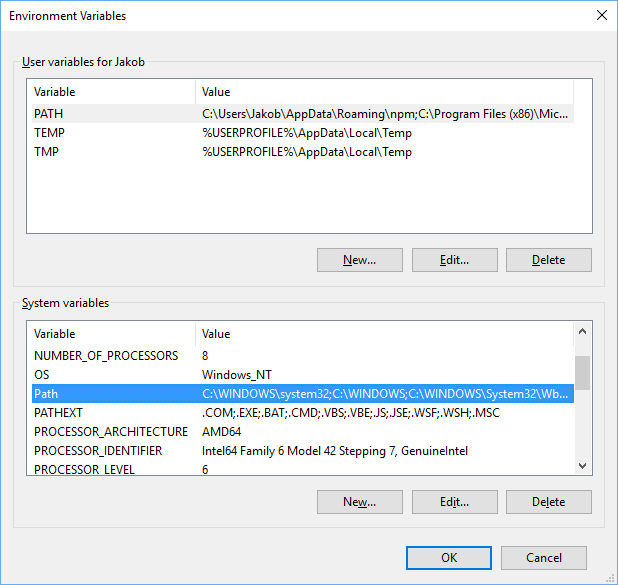

# Setting up

This walkthrough shows how to setup Pathfinder initially.

## Download Pathfinder

Run `npm install -g sitecore.pathfinder` to install Sitecore Pathfinder.

You can also install Pathfinder locally by running `npm install -saveDev sitecore.pathfinder` and adding 
a script to your package.json file:

```js
"scripts":{
    "scc": "scc"
}
```
   
You can also download Pathfinder from [here](https://github.com/JakobChristensen/Sitecore.Pathfinder/releases). Unzip
the file to the Program Files folder, e.g. `C:\Program Files (x86)\SitecorePathfinder`.

The path of the scc.cmd file should be something like `C:\Program Files (x86)\SitecorePathfinder\scc.cmd`.

Make sure that .NET Core 1.1 is installed.

## Add the directory to the Path environment variable
By adding the directory, you just created, to the path, you can execute scc.cmd from any location.

Open the Windows Advanced System Properties and add the directory to the Path variable.


